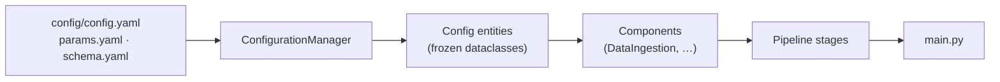

# Project-Mlops

> A config-driven ML pipeline scaffold — modular stages, YAML configuration, typed config entities, and centralised logging. Stage 01 (data ingestion) is implemented.

This repo builds out the standard end-to-end MLOps project layout: each pipeline
stage is a self-contained component, wired by a configuration manager that reads
YAML rather than hard-coded paths. `template.py` generates the whole skeleton,
so the structure is reproducible for the next project.

The worked example is a housing-price dataset, downloaded and unzipped by the
ingestion stage.

> **Status: early.** Only **stage 01 — data ingestion** is built. Validation,
> transformation, training, and evaluation stages are not written yet, and
> `app.py`, `Dockerfile`, `templates/index.html`, and `test.py` are still empty
> placeholders created by `template.py`.

## Quick start

```bash
pip install -r requirements.txt
pip install -e .          # installs the mlProject package from src/
python main.py            # runs the data ingestion stage
```

Artifacts land in `artifacts/data_ingestion/`, and logs are written to both
stdout and `logs/running_logs.log`.

## How it's wired



The pattern repeats for every stage, which is the whole point of the scaffold:

1. **Declare** the stage's inputs and outputs in `config/config.yaml`.
2. **Type** them as a frozen dataclass in `entity/config_entity.py`.
3. **Return** the populated entity from a getter in `config/configuration.py`.
4. **Implement** the work in `components/<stage>.py` — it receives only its config object.
5. **Wrap** it in `pipeline/stage_NN_<name>.py` and call it from `main.py`.

Because components take a config object and never read YAML themselves, they
stay unit-testable and the file paths live in exactly one place.

## Project structure

```
main.py                              # Stage runner — currently stage 01 only
template.py                          # Regenerates this skeleton from scratch
setup.py                             # Packages src/mlProject
config/config.yaml                   # Stage configuration (paths, source URL)
params.yaml                          # Hyperparameters — placeholder
schema.yaml                          # Data schema — placeholder
src/mlProject/
  __init__.py                        # Logger setup (stdout + logs/running_logs.log)
  constants/__init__.py              # CONFIG/PARAMS/SCHEMA file paths
  entity/config_entity.py            # Frozen dataclasses (DataIngestionConfig)
  config/configuration.py            # ConfigurationManager — YAML → entities
  components/data_ingestion.py       # ★ download + unzip
  pipeline/satge_01_data_ingestion.py
  utils/common.py                    # read_yaml, create_directories, get_size, …
research/
  01_data_ingestion.ipynb            # Notebook the stage was prototyped in
  trials.ipynb
app.py · Dockerfile · templates/     # Empty — serving layer not built yet
```

## Stage 01 — Data ingestion

`DataIngestion` does two things, both idempotent:

- `download_file()` — fetches `source_URL` to `local_data_file`, skipping the
  download if the file already exists (and logging its size instead).
- `extract_zip_file()` — unzips into `unzip_dir`, creating it if needed.

Configured by:

```yaml
data_ingestion:
  root_dir: artifacts/data_ingestion
  source_URL: https://github.com/Fezzaioussama/Custom-dataloder/raw/main/Dataset_housing_price.zip
  local_data_file: artifacts/data_ingestion/data.zip
  unzip_dir: artifacts/data_ingestion
```

## Adding a stage

Follow the five steps above, prototyping in `research/` first, then promote the
working code into `components/`. Register the new stage in `main.py` using the
same `logger.info(">>>>>> stage … started <<<<<<")` bracketing so the run log
stays readable.

## Known rough edges

- `pipeline/satge_01_data_ingestion.py` — "satge" is a typo for "stage"; renaming
  it means updating the import in `main.py`.
- `template.py` writes `params.ymal` (typo) while `constants/__init__.py` reads
  `params.yaml`. The correct file exists, but regenerating from the template
  would create the misspelled one alongside it.
- `params.yaml` and `schema.yaml` still contain placeholder `key: val` entries.
- `setup.py` passes `Long_description` — setuptools expects `long_description`,
  so the description is silently dropped.
